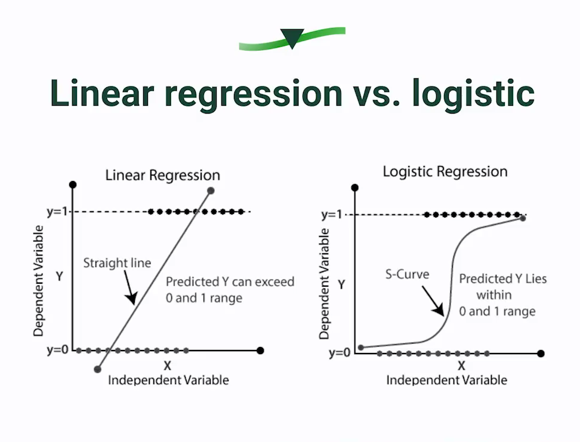
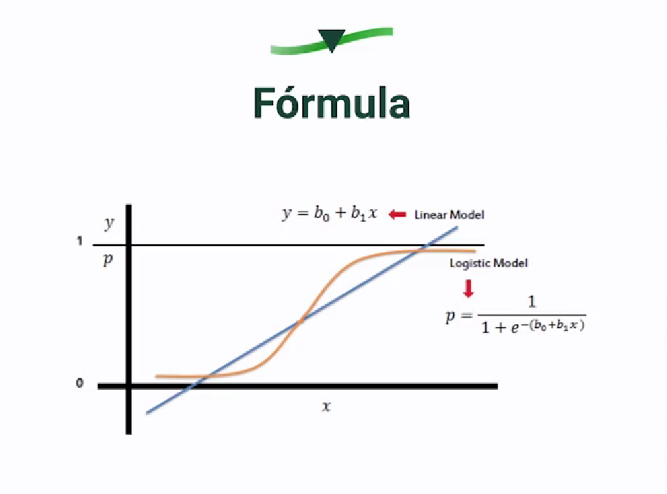
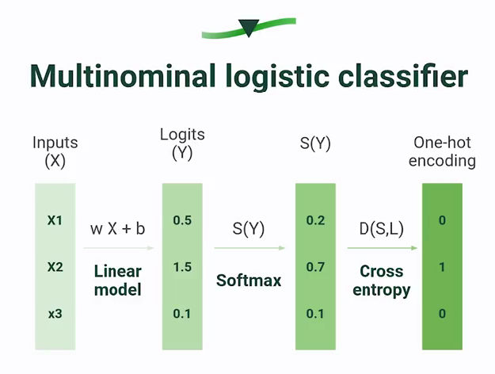
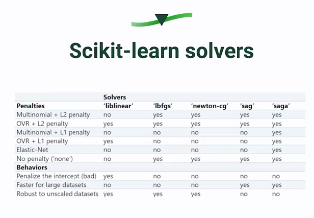

# Logistic Regression

## ¿Qué es la regresión logística?

Es un algorito supervisado que pertece a los algoritmos de clasificación. Este no busca entregarnos un valor conituo si no que buscar entregar valores de 0 o 1. Es importante la desambiguación porque es cierto que en regresión lineal buscamos predecir valores continuos. La regresión logistica en su corazón se vale de la función sigmoidal, que va desde 0 a 1, un intervalo probabilistico para nuestras observaciones.

¿Qué probabilidad tiene una observación o dato de estar en 0 o en 1?
Podemos hacer una gráfica de Probabilidad de Aprobar vs Horas de estudio, y graficor algunos puntos de datos de estudiantes que practican desde 0 a n horas, cada punto de datos se puede mapear a la función sigmoide para mapear una probabilidad tal que:

Si está entre [0.5-1] el estudiante tiene mejores chances de éxito.
Si está entre [0-0.5) el estudiante tiene menos chances de ganar.
Manjenado los intervalos de probabilidad podemos realizar clasificaciones binarias de si y no.

## Tu primera clasificación con regresión logística

https://scikit-learn.org/stable/auto_examples/linear_model/plot_sparse_logistic_regression_mnist.html

https://scikit-learn.org/stable/auto_examples/classification/plot_digits_classification.html

https://scikit-learn.org/stable/auto_examples/datasets/plot_digits_last_image.html

## ¿Cuándo usar regresión logística?

### La Regresión logistica se utiliza en los siguientes casos:

- Clasificación binaria: la regresión logística se utiliza para clasificar la observación en dos categorías distintas, como “sí” o “no”, “éxito” o “fracaso”, “compra” o “no compra”, etc.

- Datos de entrada no lineales: la regresión logística puede manejar datos de entrada no lineales y se puede utilizar para modelar la relación entre variables predictoras y variables de respuesta no lineales.

- Datos con valores atípicos: la regresión logística es robusta a los valores atípicos y no se ve afectada significativamente por los puntos de datos que se desvían de la tendencia general.

- Problemas de clasificación multiclase: si bien la regresión logística es una técnica de clasificación binaria, también se puede utilizar para problemas de clasificación multiclase mediante la técnica “uno contra todos”.

### Sintaxis
La sintaxis de sklearn permite configurar la distribucion de probabilidad o el metodo para resolver el problema
https://scikit-learn.org/stable/modules/generated/sklearn.linear_model.LogisticRegression.html#sklearn.linear_model.LogisticRegression

### Ventajas

- Fácil de implementar: Con sklearn es muy sencillo
- Coeficientes interpretables: Puedo entender los coeficientes y ver cómo se aplican.
- Inferencia: Puedes utilizar distintos features para ver cuál tiene más importancia para predecir tu variable dependiente.
- Clasificación en porcentajes: **No dice Sí y no, te da el porcentaje exacto de confianza {0,100}

### Desventajas

- Asume la linealidad: Asume que todas las relaciones son lineales y no siempre es así.
- Overfitting: Si pongo muchas features, este se aprende el patrón de entrenamiento en lugar de predecirlo.
- Multicolinealidad: Dos características que tienen el mismo comportamiento
- Datasets grandes: necesita datasets muy grandes para ser precisos, de lo contrario no alcanza a extraet toda la información.

### ¿Cuándo usarla?
- Sencillo y rápido: Cuando esto se busca.
- Prob de ocurrencia de un evento.
- Datasets linealmente separables.
- Datasets grandes.
- Datasets balanceados.

## Fórmula de regresión logística

Los “odds” (en español, “cuotas” o “probabilidades”) son una forma de expresar la probabilidad de que ocurra un evento. En particular, los “odds” representan la relación entre la probabilidad de que ocurra un evento y la probabilidad de que no ocurra.

Por ejemplo, si la probabilidad de que un equipo de fútbol gane un partido es del 60%, entonces la probabilidad de que pierda es del 40%. En términos de “odds”, la probabilidad de ganar se puede expresar como 3 a 2, lo que significa que por cada 2 veces que pierde el equipo, gana 3 veces. De manera similar, la probabilidad de perder se puede expresar como 2 a 3, lo que significa que por cada 3 veces que gana el equipo, pierde 2 veces.

Los “odds” se utilizan comúnmente en las apuestas y en los juegos de azar, donde se usan para determinar las ganancias potenciales de una apuesta. En la estadística, los “odds” se utilizan en la regresión logística para modelar la relación entre las variables independientes y la variable dependiente binaria.

## Preparando los datos

Antes de realizar cualquier acción de predicción se debe:

- Eliminar duplicados.
- Evaluar valores nulos.
- Remover columnas innecesarias.
- Procesar datos categóricos.
- Remover outliers.
- Escalar Data.

# Análisis de correlación y escalabilidad de los datos

Hay un concepto en Machine Learning llamado DATA LEAKAGE, que basicamente consiste en que información fuera de los datos de entrenamiento es usada para entrenar el modelo, por ejemplo entrenar un escalador con todos los datos cuando debería ser solo entrenado con los datos de entrenamiento , esto genera que se puedan obtener resultados muy optimistas al entrenar nuestro modelo,pueden leer sobre eso aquí:
https://machinelearningmastery.com/data-leakage-machine-learning/

# Análisis exploratorio de datos

Es recomendable hacerlo con el DF original.
https://platzi.com/cursos/matplotlib-seaborn/

# Entrenamiento con regresión logística binomial

- Aplicar Para datos no balanceados

    - Video: https://www.youtube.com/watch?v=4SivdTLIwHc
    - Codigo: https://github.com/dataprofessor/imbalanced-data/blob/main/imbalanced_learn.ipynb
    - Documentación methodologies: https://imbalanced-learn.org/stable/references/index.html
    - SMOTE VS SMOTEN: https://datascience.stackexchange.com/questions/60684/smote-vs-smote-nc-for-binary-classifier-with-categorical-and-numeric-data

    - Techniques: https://www.youtube.com/watch?v=GR-OW5asKlk

- Spliting Data

- Rescaling

- Model

# Evaluando el modelo (MLE)- MAXIMUN LIKELIHOOD ESTIMATOR
- Más alto MLE mejor está haciendo la predicción.
- Gradient descente disminuye la función de costo

# Regularización
Esta técnica consiste en disminuir la complejidad de nuestro modelo a través de una penalización aplicada a sus variables más irrelevantes.
Para este ejemplo compararemos los resultados obtenidos con los distintos métodos de regularización usando la misma semilla y el mismo solver (saga)

## Tipos

- L1 Lasso: Reduce la complejidad a través de eliminación de features que no aportan demasiado al modelo.
Penaliza a los features que aporta poca información volviéndolos cero, eliminado el ruido que producen en el modelo.
        - C es un parámetro que define que tanto se penaliza a los features que menos aportan, debe ser siempre un valor positivo y mientras mas pequeño mayor sera la penalización
- L2 Ridge: Reduce la complejidad disminuyendo el impacto de ciertos features a nuestro modelo.
Penaliza los features poco relevantes, pero no los vuelve cero. Solamente limita la información que aportan a nuestro modelo.

## Lasso vs Ridge
1. No hay un campeón definitivo para todos los problemas.
2. Si hay pocos features que se relacionen directamente con la variable a predecir: Probar Lasso.
3. Si hay varios features relacionados con la variable a predecir: Probar Ridge.

Para aplicarlos y decidir cuál es el mejor en la práctica, podemos probar usando alguna técnica como cross-validation iterativamente. o bien, podemos combinarlos…

## ElasticNet: Una técnica intermedia:

Hasta el momento hemos podido ver dos técnicas de regularización en las cuales añadimos un componente de penalización en el proceso donde encontramos los valores de los parámetros 𝛽 minimizando la función de error.

Es común encontrarnos en la literatura con un camino intermedio llamado ElasticNet. Esta técnica consiste en combinar las dos penalizaciones anteriores en una sola función.

**Cuando usamos ElasticNet:**

1. Tenemos una forma de probar ambas L1 y L2 al tiempo sin perder información.
2. Supera las limitaciones individuales de ellas.
3. Si hace falta experiencia, o el conocimiento matemático de fondo, puede ser la opción preferente para probar la regularización.

Para implementar ElasticNet ahora vamos a usar l1_ratio el cual puede tomar valores entre 0 a 1. Si l1_ratio = 0 , ElasticNet se comportará como Ridge, y si l1_ratio = 1 , se comportará como Lasso. Por lo tanto, nos brinda todo el espectro lineal de posibles combinaciones entre estos dos extremos.

En este caso simplemente vamos a comparar el accuracy que obtenemos con distintos valores de l1_ratio:

# Cómo funciona la regresión logística multiclase

Documentación de donde obtuvo la tabla de solvers😄: https://scikit-learn.org/stable/modules/linear_model.html

Parámetros de la LogReg que aplican a la multicalse, el algoritmo matemático para optimizar descenso de gradiente

# F1-Score Considerations

- Important parameter average if multiclass: https://stackoverflow.com/questions/52269187/facing-valueerror-target-is-multiclass-but-average-binary

# Otros recursos
https://deepnote.com/@mazzaroli/Regresion-Logistica-con-Python-y-scikit-learn-cd6b9628-59c3-4496-8abc-8beb77d9b4ff

- Multicollinearity: https://statisticsbyjim.com/regression/multicollinearity-in-regression-analysis/